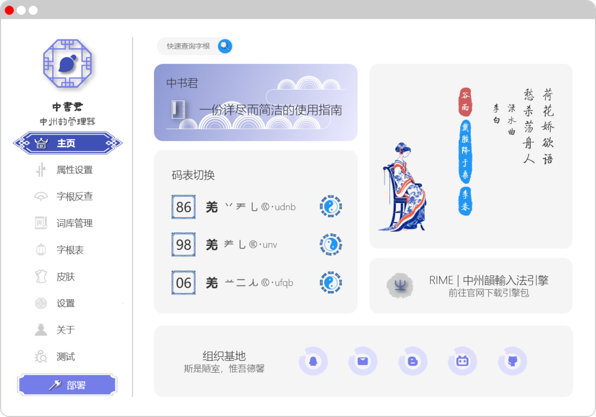
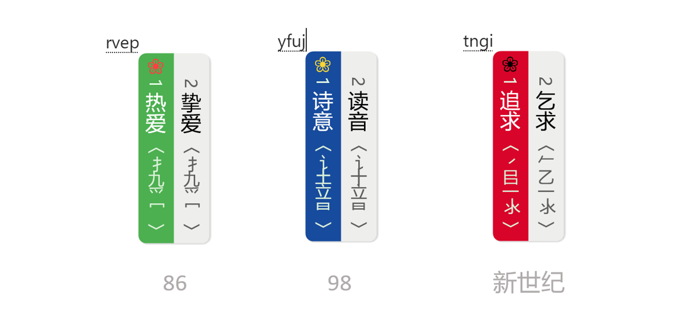

# 写给热爱打字的你

> 我们曾是诗的国度，你我的魂早已浸透了仓颉的恩泽。   
> 相信你也曾像太白一样诗意盎然，忽复乘舟梦日边。   
> 也曾挥毫间，畅想兰亭轶闻，放浪形骸于山水之间。   
> 你有你的故事，我有我的酒。   
> 用最初的文字，记录每一处痕迹，直到盛满整个星汉。   
> 当你用它打字时，你就成了最浪漫的诗人！  
> ——空山明月

# 预览

## 介绍

**【中书君】** 是一款针对于 Rime 输入法引擎的管理器，最初的愿望是希望它能支持五笔输入方案的属性、词库等方面的管理。最终还希望它能完美地兼容更多输入方案（如简拼、双拼等）的管理，以提升 Rime 的使用体验。

目前，本软件还处于研发阶段，相应功能会持续更新，如有特殊需求，可提交 ISSUES.

如果对您有帮助，请帮我在右上角点个星，谢啦~~~ ⭐

## 软件架构

|  关键技术   | 描述  |
|  ----  | ----  |
| 开发语言  | C# |
| 开发框架  | .NET Core / WPF |
| 框架版本  | .NET 6 |
| 开发工具  | Visual Studio 2022 |
| 设计模式  | Mvvm / CommunityToolkit.Mvvm |
| 第三方库  | Log4.net / CommunityToolkit.Mvvm / Newtonsoft.Json / YamlDotNet / Behaviossr.Wpf |
| 打包环境  | Inno Setup |

## 打字效果

支持86、98和新世纪码表

### 方案地址

https://gitee.com/hi-coder/rime-86wubi

## 捐赠

> 感谢您选择并使用这款开源软件！您的信任与支持是我持续前进的动力。  
> 开源软件的研发与维护离不开开发者的辛勤付出与无私奉献。为了保持软件的持续更新与优化，恳请您在能力范围内考虑对本项目进行捐赠。  
> 您的每一份捐赠，都将直接用于软件的开发、测试、维护以及优化，帮助更多用户享受到更好的使用体验。  
> 您可以选择通过支付宝、微信等在线支付平台进行捐赠，捐赠金额不限，您的每一份心意我都将倍加珍惜。  
>  再次感谢您的支持与厚爱！祝您生活愉快，工作顺利！  
> 空山明月 敬上

## QQ群

欢迎您的加入！

