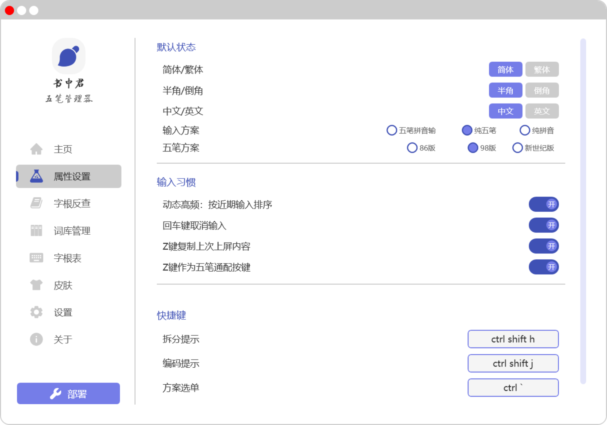
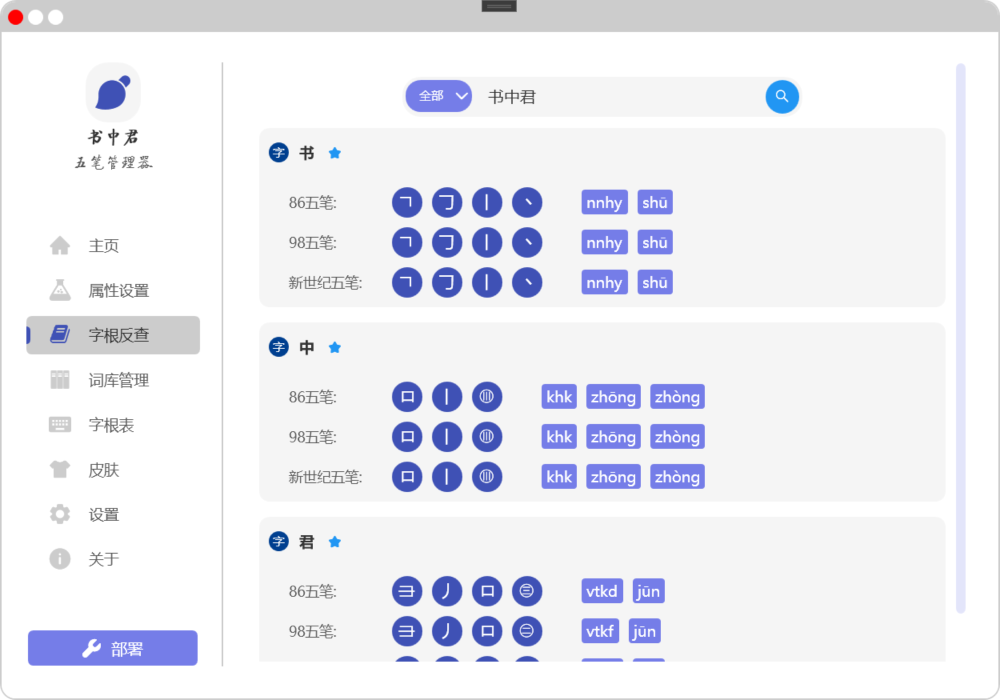
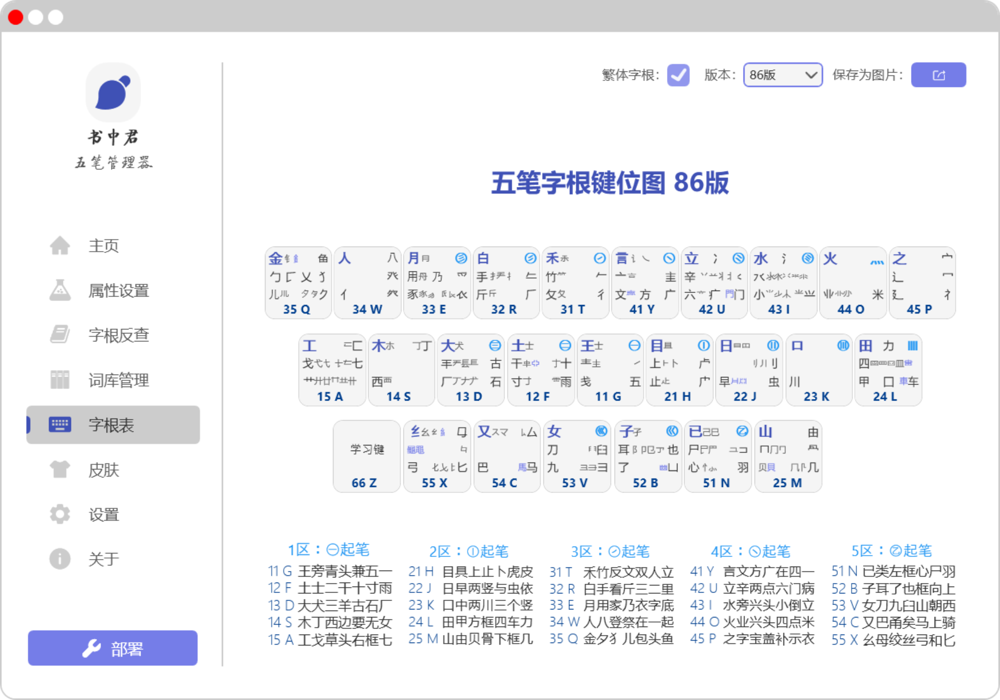
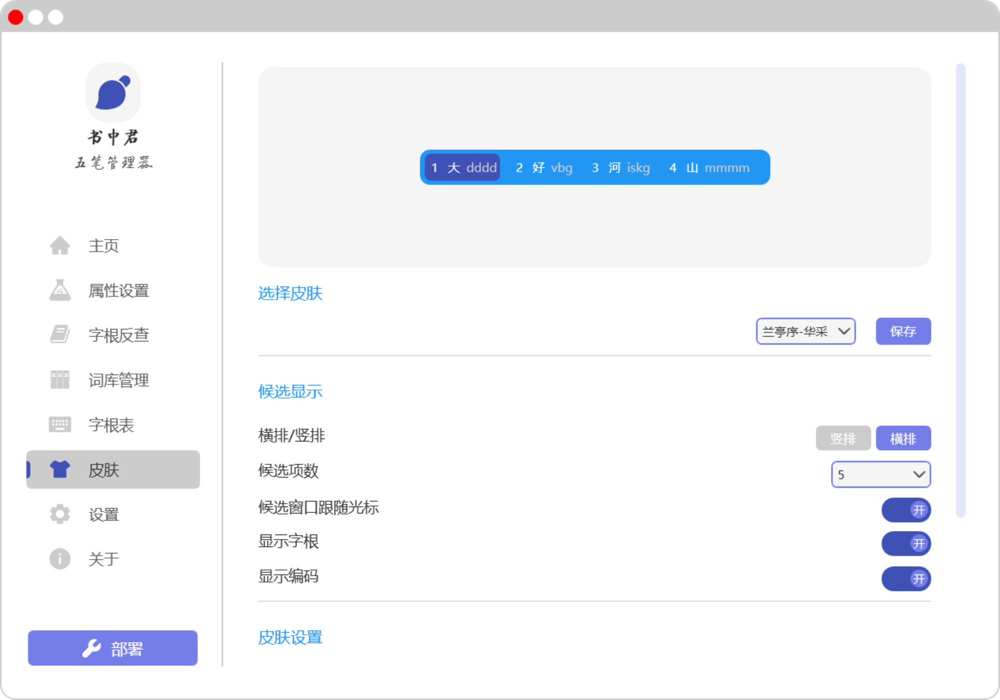
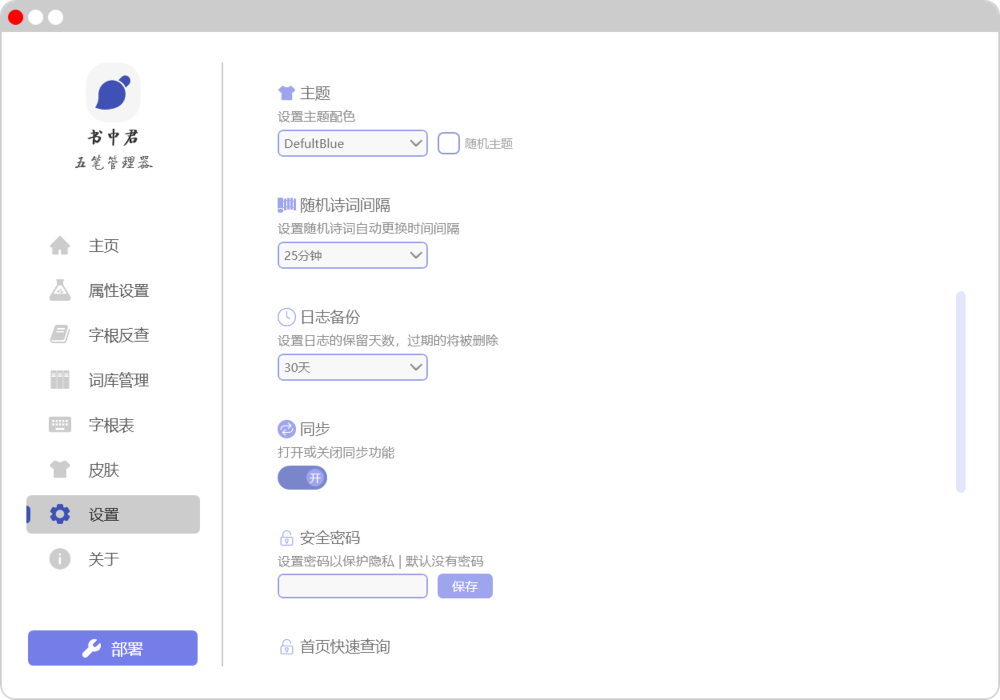

# 书中君

## 介绍

🎯 **【书中君】** 是一款针对于 Rime 输入法引擎的管理器，最初的愿望是希望它能支持五笔输入方案的属性、词库等方面的管理。最终还希望它能完美地兼容更多输入方案（如简拼、双拼等）的管理，以提升 Rime 的使用体验。

📢 目前，本软件还处于研发阶段，相应功能会持续更新，如有特殊需求，可提交 ISSUES.

⭐ 如果对您有帮助，请帮我在右上角点个星，谢啦~~~ ⭐

## 软件架构

|  关键技术   | 描述  |
|  ----  | ----  |
| 开发语言  | C# |
| 开发框架  | .NET Core / WPF |
| 框架版本  | .NET 6 |
| 开发工具  | Visual Studio 2022 |
| 设计模式  | Mvvm / CommunityToolkit.Mvvm |
| 第三方库  | Log4.net / CommunityToolkit.Mvvm / Newtonsoft.Json / YamlDotNet / Behaviossr.Wpf |
| 打包环境  | Inno Setup |

## 预览

## 安装教程

......

## 使用说明

### 一键导入方案

*💡 提示：导入方案前要求已安装 Rime 引擎包！*

以86版五笔方案为例。在书中君首页的「一键导入方案」卡片下，点击86版的齿轮按钮，软件内置86版五笔方案，此时，将会在 Rime 引擎下自动配置86五笔方案。

*📢 该动作将会清除 Rime 用户目录下的原有方案及所有配置信息！*

### 汉字拆分及编码查询

在【字根反查】页面，输入字或词，即可查询相应的拆分及编码。

📢 支持字和词，词的最长输入长度为10个。

💡 下一步本功能将支持收藏与查看历史功能。

## 参与贡献

......

## QQ群

点击链接加入群聊【书中君·五笔斋】：https://qm.qq.com/q/2r4g68Sdf2

或使用二维码加入群聊：

## 日志

- 2024-3-22 项目开源
- 2024-3-26 添加一键配置方案功能（86版五笔）
- 2024-3-28 修复无法检测Rime安装信息问题
- 2024-3-29 添加拆字查询功能（基础，无收藏与历史查询功能）
- 2024-04-01 新增98方案一键配置功能
- 2024-04-01 新增方案备份功能